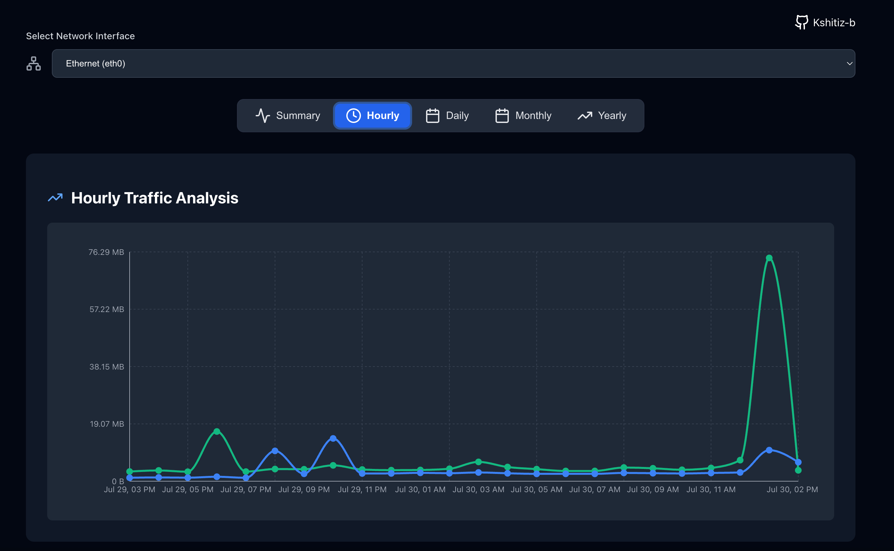

#  VNStat Dashboard

A sleek, responsive, containerized web dashboard to visualize network interface statistics using [`vnstat`](https://github.com/vergoh/vnstat).

Mainly build for ARMv8/AMD64 devices.

---

## ✨ Features

- Real-time traffic display from `vnstat`
- Graphs for Hourly, Daily, Monthly, Yearly usage
- Responsive, dark-mode friendly UI
- Dockerized for portability
- Uses a single container for backend + frontend
- Automatically detects and serves from interfaces like `eth0`, `wlan0`, `docker0`, and `tailscale0`

---

## 📦 Technologies Used

- **Frontend**: React + TailwindCSS + Recharts
- **Backend**: Node.js + Express
- **System**: vnStat CLI
- **Containerization**: Docker (multi-stage build)

---

## 🚀 Getting Started

### 1. Clone the Repository

```bash
git clone https://github.com/Kshitiz-b/vnstat-dashboard.git
cd vnstat-dashboard
```

### 2. Build Docker Image

```bash
docker build -t vnstat-dashboard .
```

### 3. Run the Container

Make sure to use `--privileged` so that `vnstat` inside the container can access system data:

```bash
docker run -d \
  --name vnstat-dashboard \
  --privileged \
  --network host \
  vnstat-dashboard
```

### 4. Access the Dashboard

Open your browser and navigate to:

```
http://localhost:8050
```

---

## [`Docker Installation`](https://hub.docker.com/r/kshitizb/vnstat-dashboard)

### 🐳 **Docker Pull Command**

```bash
docker pull kshitizb/vnstat-dashboard
```

> 🔁 This pulls the latest image from Docker Hub.

### 🚀 **Run the Container (with Port Mapping)**

Use this if you want to access the app via `http://localhost:8050`:

```bash
docker run -d \
  --name vnstat-dashboard \
  --privileged \
  -p 8050:8050 \
  kshitizb/vnstat-dashboard
```

### 🌐 **Run the Container (with Host Networking)**

Use this on **Linux** if you prefer the container to use the host’s network directly:

```bash
docker run -d \
  --name vnstat-dashboard \
  --privileged \
  --network host \
  kshitizb/vnstat-dashboard
```

> ✅ Use this option if `vnstat` in the container needs to directly access the host's network interfaces like `eth0`, `wlan0`, `docker0`, `tailscale0`.

### 🧭 **Access the Dashboard**

Once running, open your browser and go to:

```
http://localhost:8050
```

(or `http://<your-host-ip>:8050` if not using localhost)

---

## 🖼️ Screenshot





---

## 🔧 Requirements

- Docker installed
- `vnstat` installed and daemon running on host (`sudo apt install vnstat`)
- Raspberry Pi or any ARMv8/AMD64 compatible Linux device

---

## 🐳 Ports & API

- **Frontend + API served on same port**: `8050`
- Backend API: `/api/vnstat/:interface`
  - Example: `/api/vnstat/eth0`
  - Example: `/api/vnstat/wlan0`

---

## 🧩 Directory Structure

```
.
├── backend/
│   └── server.js
├── frontend/
│   ├── public/
│   └── src/
├── preview/
├── Dockerfile
└── README.md
```

---

## 📛 Customization

- Change default interfaces in `backend/server.js`:
  ```js
  const ALLOWED_INTERFACES = ['eth0', 'wlan0', 'docker0', 'tailscale0'];
  ```

- Edit UI/theme in `frontend/src/App.js` and Tailwind styles

---

## 📝 License

MIT © 2025 Kshitiz

---